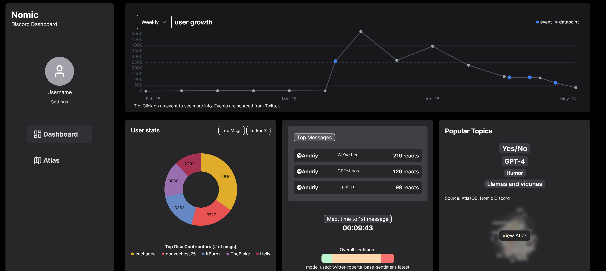
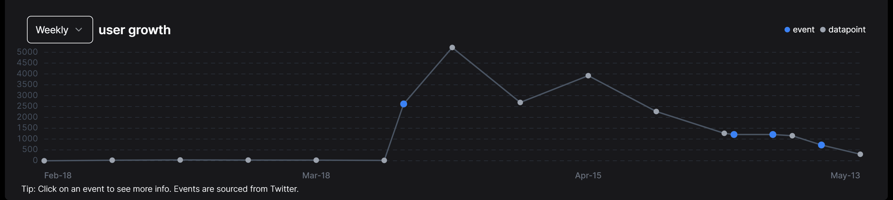
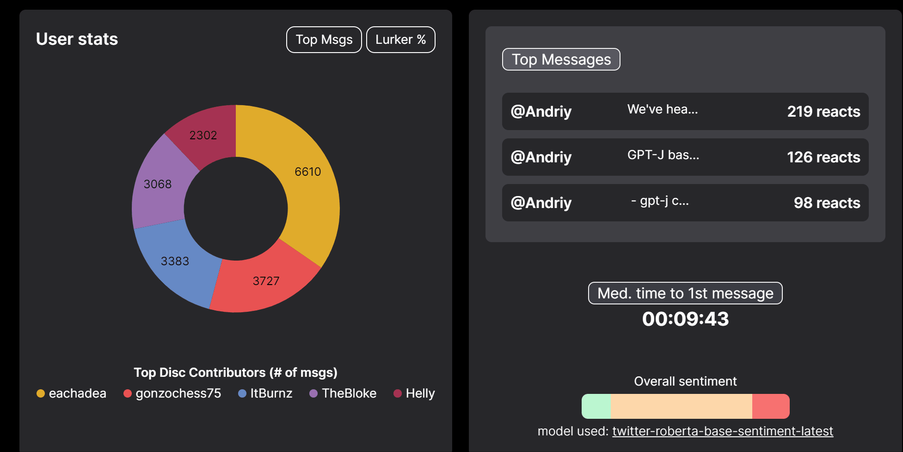
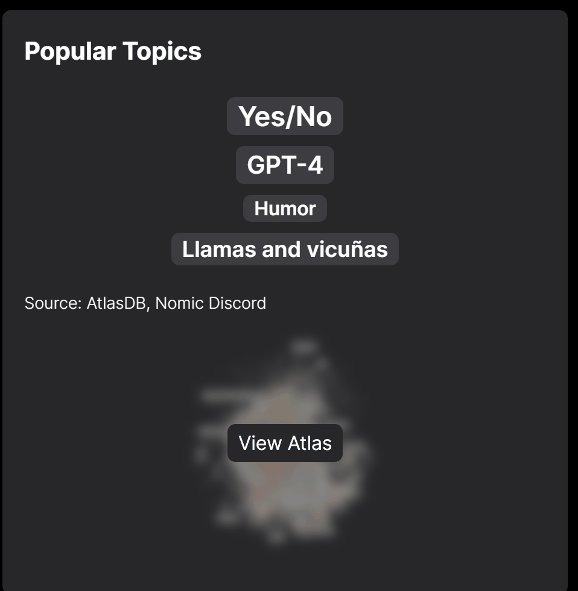

# NomicCDSApplication

## How to run
`make build` will build a docker container for both the FastAPI backend and NextJS frontend.

`make run` will start both instances. App can be found at http://127.0.0.1:3000

## Nomic Discord Dashboard built for the Community Data Scientist role @ NomicAI.
Features:
- Weekly user growth chart w/ external events (based on tweets from @nomicAI's twitter) annotated.
- Top Contributors donut chart.
- Lurker : Contributor ratio donut chart.
- Top "engaged" messages (measured based on reactions).
- Median time to 1st contribution in Discord (measures the speed at which users convert from lurkers to contributors/engagers - lower time, the more engaged new-comers are).
- Overall Sentiment -> used twitter-roberta-base model to classify full dataset (excluding joins channel) of >70k messages (1st order approximation of community health/engagement, of course in a production setting, this would need finetuning, better data cleaning, etc.).
- Top topics as extracted via Atlas.
- Embedded Atlas map.
- Dockerized FastAPI.

Notes:
- Scripts directory holds both the script to scrape Discord messages (requires an auth token) and perform sentiment analysis using a HuggingFace inference endpoint.
- Instead of rolling a db (i.e. sqlite) I opted to use a pandas dataframe loaded in memory as the datasets were relatively small.

## Demo

### Member Growth
- Member growth is based on dedupped messages from the "joins" channel as a proxy for new member joins
- Events are pulled from twitter and saved as a separate dataframe

### User Stats
- Pie chart measures top contributors by message count and the lurker : contributor ratio across all channels (lurkers are defined as users who have not yet sent a message. Could be improved by measuring user who have not sent a message for X amount of time and some cleaning as to message content)
- Top Messages by reactions are measured by aggregating "emoji" reactions across all messages in discord
- Median time to first message is taken across all channels excluding joins (measured as time user joins server compared to timestamp of first message)
- Overall sentiment is measured by classifying each message (post some cleaning and preprocessing) using a roberta-sentiment model from HuggingFace

### Atlas and Top Topics
- Cleaned and preprocessed messages are uploaded to atlas map (which is embedded in iframe)
- Top topics are taken from the atlas `map.get_topic_data()` api method (this could be improved by adding more filters/processing/cleaning steps)
- 

